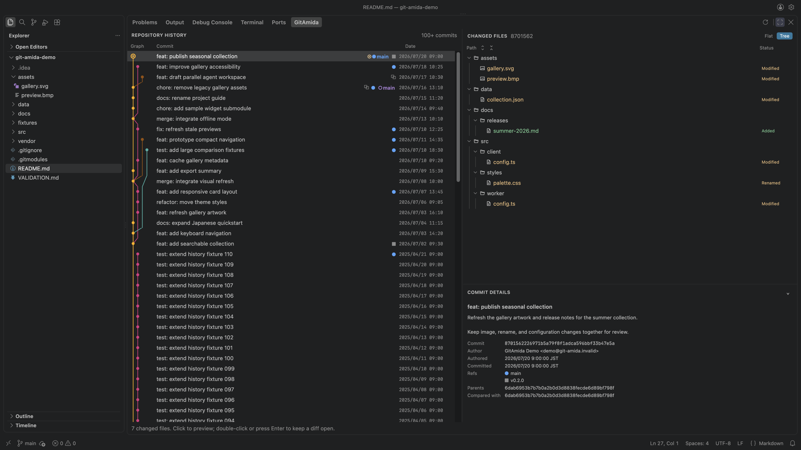
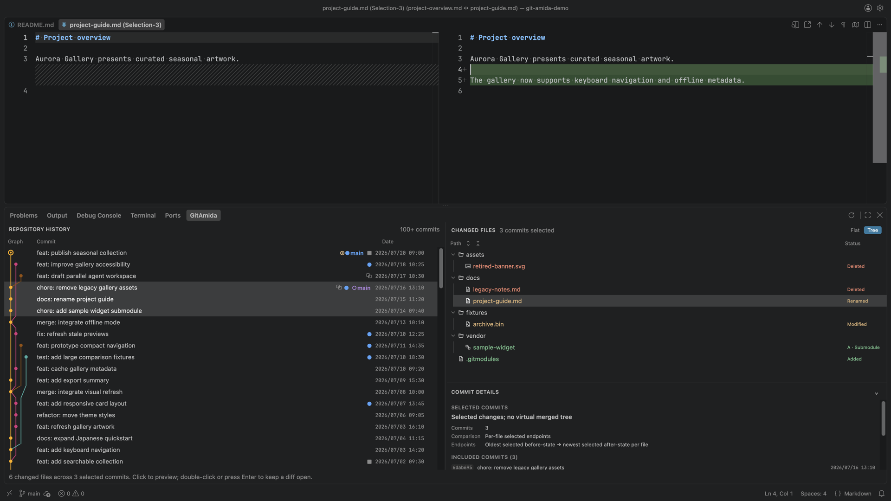
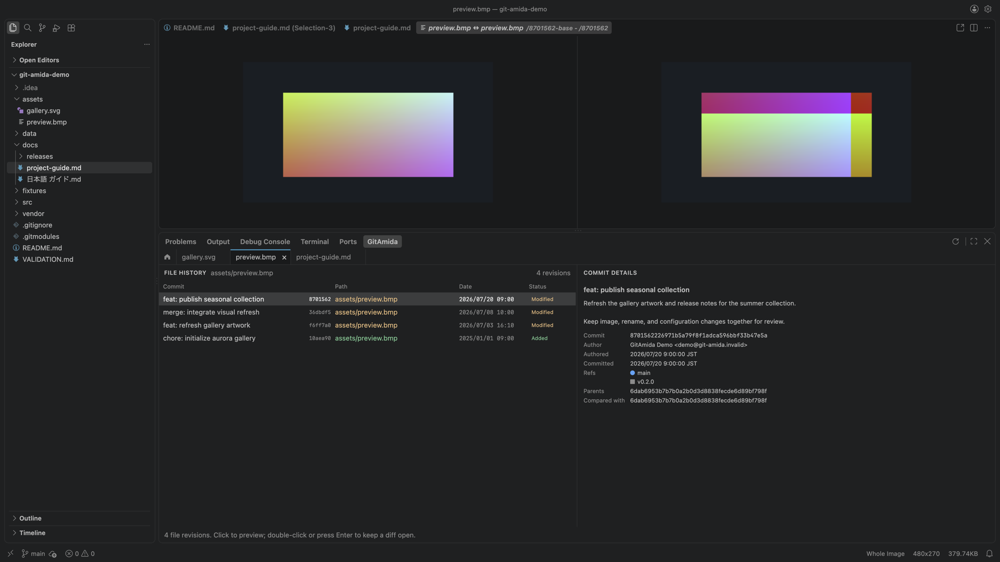

# GitAmida

> Follow the line through your Git history.

GitAmida keeps repository and file history connected in the bottom Panel while opening exact changes in the native diff editor in Cursor and VS Code.

## Highlights

- Shows a compact, theme-aware commit graph with branches, tags, linked worktree locations, commit details, and saved working-tree changes
- Selects a continuous Range with Shift or an explicit Selection with Cmd/Ctrl, then explains the real Git endpoints used for each changed file
- Opens several independent File History tabs and returns from a revision to its commit in Repository History
- Previews text and supported image changes in the native editor, with the editor's standard fallback for other binary files
- Reopens one comparison in the configured Git difftool using exact before and after endpoint copies
- Restores one historical file version or switches to a named local branch only after explicit safety checks and confirmation
- Keeps repository navigation and open File History tabs transient to the current editor session

## Screenshots

**Repository History** — Navigate the commit graph and inspect changed files and commit details without leaving the Panel.

**Selected commits** — Review one explainable file comparison across a continuous range or explicit commit selection.

**File History** — Keep several file investigations open and preview supported image revisions in the native diff editor.

## Getting started

1. Open a local Git workspace in Cursor or VS Code.
2. Run **GitAmida: Open** from the Command Palette.
3. Select a commit or **Uncommitted changes** to inspect its files and details.
4. Shift-select a visible interval, or use Cmd/Ctrl+click to include individual commits.
5. Select a changed file to preview its comparison; press Enter, double-click, or choose **Open Changes** to pin it.
6. Use the Changed-files context menu for File History, an external difftool, or safe file restoration.

## Requirements

- VS Code 1.100.0 or later, or a compatible Cursor desktop build
- A file-system workspace with the Git CLI available as `git` in the Extension Host environment
- A trusted workspace; GitAmida is disabled in Restricted Mode because it invokes Git and offers explicitly requested repository and file mutations

## Current limitations

- Validated on macOS, with basic smoke testing on Windows. Linux and VS Code Remote Development are expected to work but have not yet been validated
- Virtual workspaces and VS Code for the Web are not supported
- In a multi-root workspace, GitAmida uses the active editor's workspace folder, or the first folder when no editor is active
- Text blobs above the current `diffEditor.maxFileSize` setting and submodules remain visible but do not open as native comparisons

## Privacy

GitAmida reads repository contents and metadata locally to render history and prepare diffs. It does not collect telemetry or analytics, and it does not transmit repository contents or personal information to a GitAmida-operated service. An external difftool receives local temporary endpoint copies only after the user explicitly invokes that action.

## Support

[Report a problem or request a feature](https://github.com/hirosco/vscode-git-amida/issues).

## License

GitAmida is available under the [MIT License](./LICENSE). It is an independent project and is not affiliated with or endorsed by Microsoft, GitHub, or Anysphere.
