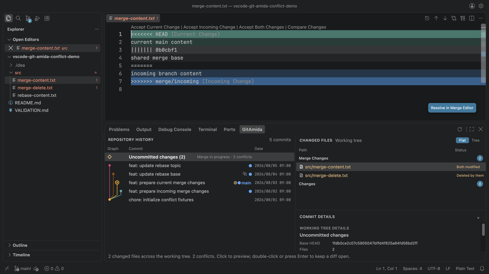

# GitAmida

GitAmida does one thing: make Git history readable. It is not a full Git client
and does not replace the editor's built-in Source Control view.

Select a range of commits and see what changed across the whole range in one
view. Keep your code open in the editor while you follow its history in the
bottom Panel, moving between repository history and file history without losing
your place. Comparisons open in the editor's native diff view, not a custom one.

## Install

- **Cursor:** Search Extensions for `GitAmida`, or [open the Open VSX listing](https://open-vsx.org/extension/hirosco/git-amida)
- **VS Code:** Search Extensions for `GitAmida`, or [open the Visual Studio Marketplace listing](https://marketplace.visualstudio.com/items?itemName=hirosco.git-amida)

## Highlights

- Makes Repository History scannable with a compact, theme-aware commit graph, branches, tags, linked worktree locations, commit details, and saved working-tree changes
- Explains the real Git endpoints used for each changed file in both continuous ranges and explicit commit selections
- Keeps several File History investigations open and returns any revision to its commit in Repository History
- Previews supported text and image changes in the native editor, resolving only the selected historical Git LFS content when needed
- Surfaces conflicts from merges, rebases, cherry-picks, reverts, and stash application, then hands supported files to the host editor's native resolution flow
- Keeps optional tools and mutations explicit: external diff and merge tools, safety-checked file restoration, and named branch switching

## More screenshots

**File History** — Keep several file investigations open and preview supported image revisions in the native diff editor.

**Conflict resolution** — Inspect unresolved paths in GitAmida, then continue in the host editor's native conflict flow.

## Getting started

1. Open a local Git workspace in Cursor or VS Code.
2. Run **GitAmida: Open** from the Command Palette.
3. Select a commit or **Uncommitted changes** to inspect its files and details.
4. Shift-select a visible interval, or use Cmd/Ctrl+click to include individual commits.
5. Select a changed file to preview its comparison; press Enter, double-click, or choose **Open Changes** to pin it.
6. Use the Changed-files context menu for File History, the current working-tree file, path copying, an external difftool, or safe file restoration.

## Conflict workflow

When Git has unresolved index entries, GitAmida counts them, separates **Merge Changes** from **Changes**, and labels reliable in-progress merge, rebase, cherry-pick, and revert states. Unclassified sources such as stash application remain generic. Supported content conflicts open in the host editor's native resolution flow, with a configured Git mergetool available as a secondary choice before entering the Merge Editor. Modify/delete conflicts are resolved from Source Control. GitAmida does not stage files or complete the Git operation.

## Requirements

- VS Code 1.100.0 or later, or a compatible Cursor desktop build
- A file-system workspace with the Git CLI available as `git` in the Extension Host environment
- Git LFS when a selected historical LFS object is not already available in the repository's local LFS storage
- A trusted workspace; GitAmida is disabled in Restricted Mode because it invokes Git and offers explicitly requested repository and file mutations

## Current limitations

- Validated on macOS, with basic smoke testing on Windows. Linux and VS Code Remote Development are expected to work but have not yet been validated
- Virtual workspaces and VS Code for the Web are not supported
- In a multi-root workspace, GitAmida uses the active editor's workspace folder, or the first folder when no editor is active
- To inspect files inside a nested repository such as a submodule, open that repository as its own workspace; the parent repository still shows its submodule pointer history
- Text blobs above the current `diffEditor.maxFileSize` setting and submodules remain visible but do not open as native comparisons
- Modify/delete conflicts are resolved from Source Control

## Privacy

GitAmida reads repository contents and metadata locally to render history and prepare diffs. It does not collect telemetry or analytics, and it does not transmit repository contents or personal information to a GitAmida-operated service. When selected historical Git LFS content is missing locally, GitAmida fetches only those exact endpoints from the repository's configured LFS remote with cancellable progress. An external difftool receives local temporary endpoint copies only after the user explicitly invokes that action. An explicitly invoked Git mergetool operates on the live conflicted file and may modify or stage it according to Git and tool configuration.

## Support

[Report a problem or request a feature](https://github.com/hirosco/vscode-git-amida/issues).

## License

GitAmida is available under the [MIT License](./LICENSE). It is an independent project and is not affiliated with or endorsed by Microsoft, GitHub, or Anysphere.
